# Домофон ПК — DomruDesktop 0.1.30

Неофициальный Windows-клиент для собственного аккаунта «Умный Дом.ру». C# / .NET 10 / WPF, без рекламы и аналитики.

## Возможности

- Авторизация по договору и паролю; вход по телефону и SMS.
- Камера, автоматическое воспроизведение, режим минимальной задержки и полный экран.
- События и архив: сегодня, вчера, позавчера; просмотр записи и перемотка.
- Снимки в PNG в исходном разрешении видеопотока. Full HD сохраняется, если источник передаёт 1920×1080; разрешение показывается после сохранения.
- Список ключей, сведения об аккаунте и ссылки на официальные страницы оплаты.
- Входящие звонки: WSS/STOMP, FCM, SIP/RTP, разговор после ответа и открытие двери.
- Работа в трее, сворачивание при закрытии и необязательная автозагрузка (по умолчанию выключена).
- Выбор звуковых устройств, проверка микрофона, проверка левого/правого/обоих каналов наушников.
- Встроенный рингтон и локальный тестовый вызов с синтетическим видео и записью голоса для прослушивания. «Открыть дверь» в тесте только показывает подтверждение и не отправляет команду домофону.

## Скриншоты интерфейса

Версия 0.1.30. На снимках используются только демонстрационные адрес, аккаунт, события, ключи и суммы оплаты. Изображение камеры — кадр встроенного синтетического тестового видео. Настоящие данные аккаунта и видеозаписи домофона не опубликованы. PNG сохранены в двойном разрешении; нажмите на изображение, чтобы открыть его полностью.

### Камера

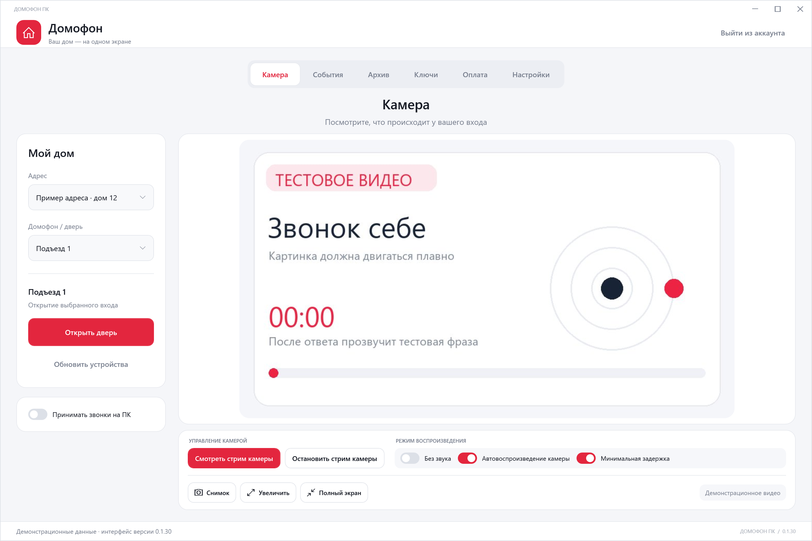

### События

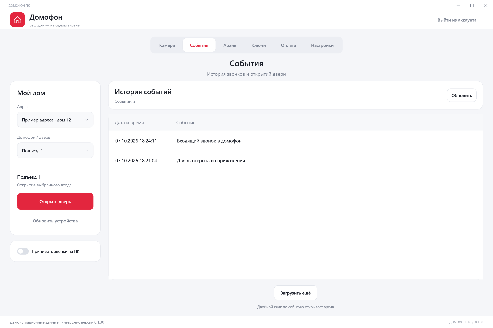

### Архив

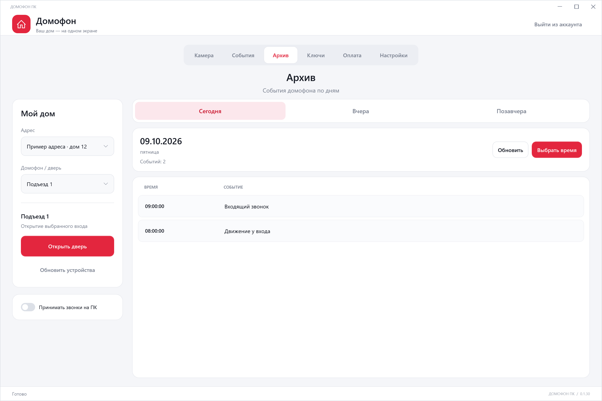

### Просмотр записи

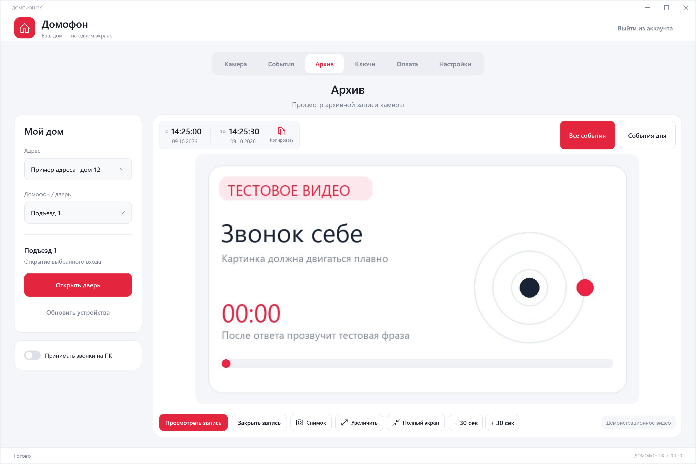

### Ключи

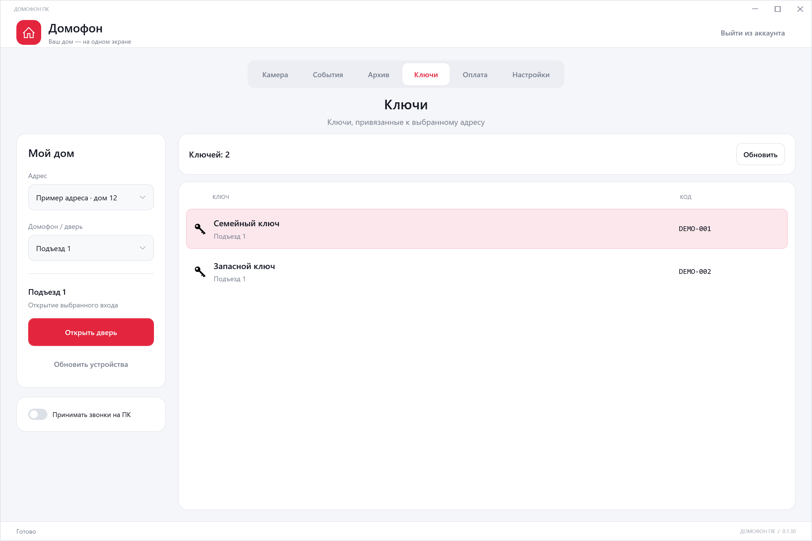

### Оплата и аккаунт

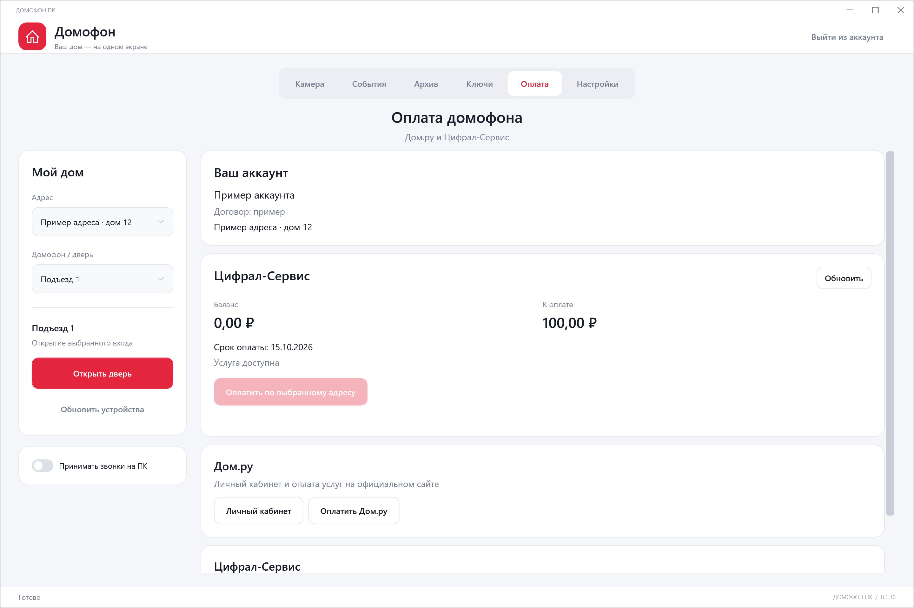

### Настройки: тестовый вызов и работа в фоне

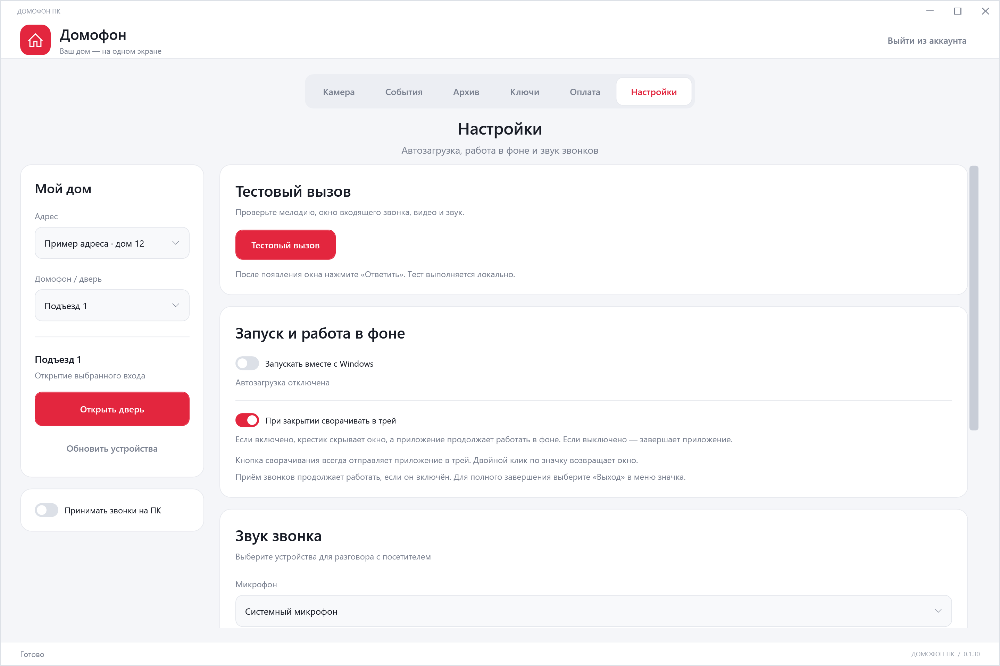

### Настройки: звук и подключение

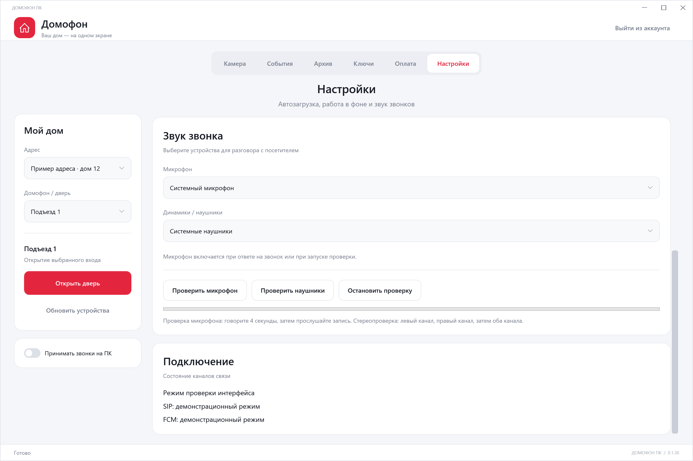

### Вход по договору

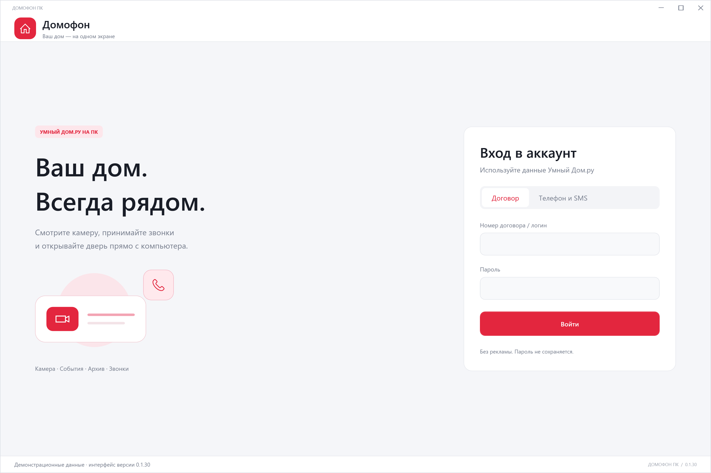

### Вход по телефону и SMS

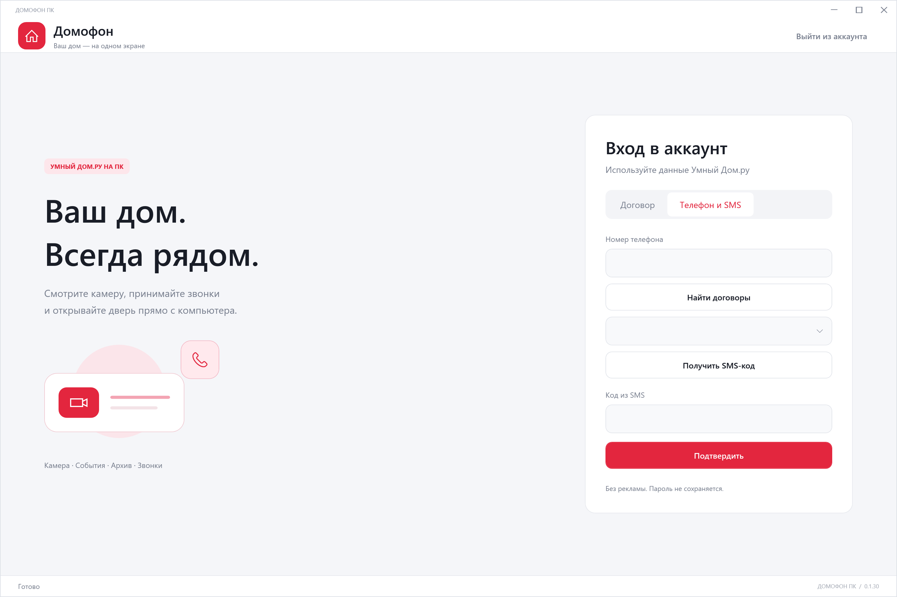

### Окно входящего звонка

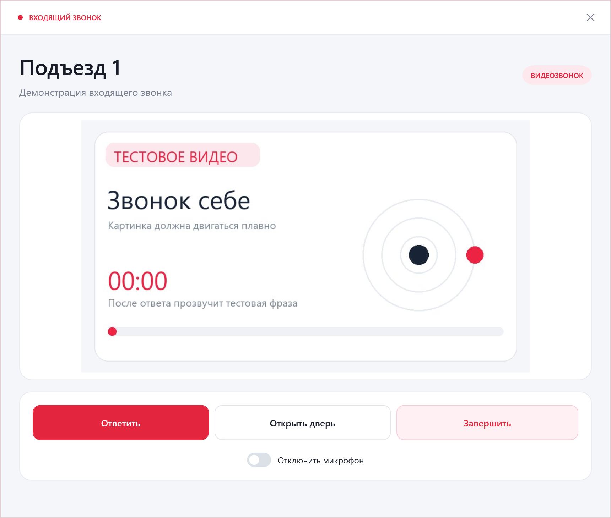

## Установка

Скачайте Windows x64 ZIP в разделе Releases, распакуйте и запустите `DomruDesktop.exe`. Сохраняйте структуру папки: видео-движок и .NET runtime поставляются рядом. Устанавливать .NET или VLC отдельно не требуется.

Для настоящего открытия двери используется кнопка основного окна или реального входящего вызова. Микрофон включается после ответа либо во время явно запущенной проверки.

## Локальные данные и приватность

Пароль не сохраняется. Сессии и ключи push хранятся с Windows DPAPI для текущего пользователя в `%LOCALAPPDATA%\DomruDesktop`; локальные настройки устройств и интерфейса находятся там же. В репозиторий и релиз не входят данные аккаунта, токены сессии, SIP-пароли, подписанные URL видео, журналы, снимки домофона и отладочные PDB.

Константы протокола авторизации и публичные идентификаторы Firebase используются для совместимости с Android-клиентом и не относятся к учётной записи пользователя. Тестовые учётные данные синтетические. Криптографические тестовые ключи создаются заново локальным генератором и не хранятся в репозитории.

## Сборка

Требуются Windows x64, .NET 10 SDK и Python 3.12 для генерации независимых тестовых векторов:

```powershell
python -m pip install -r Domru.Tests/requirements.txt
python Domru.Tests/generate_crypto_vectors.py
dotnet run --project Domru.Tests/Domru.Tests.csproj
./build.ps1
```

`Domru.Probe` — вспомогательный инструмент разработки, не включён в исполняемый дистрибутив. Для его использования нужны собственные локальные данные авторизации.

## Ограничения

Доступность архива, ключей, оплаты и звонков зависит от оборудования, аккаунта и API оператора. Нулевая задержка камеры не гарантируется. Локальные проверки клиента не заменяют проверку реального входящего вызова с панели и физического разговора. Проект не связан с Дом.ру или Цифрал-Сервис.

[Устройство протоколов](REVERSE_ENGINEERING.md) · [Сторонние компоненты](THIRD_PARTY.md) · [Изменения](CHANGELOG.md)
